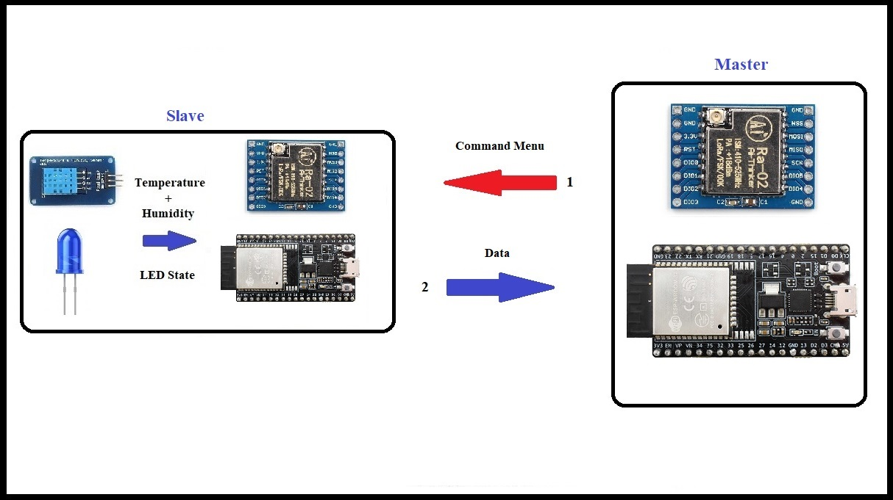

                                       
 
# 🌐 LoRa Communication System 

This project implements a LoRa communication system using the RH_RF95 library for long-range communication. The system consists of a master device and a node device, where the master can send commands to the node to retrieve sensor data or control devices.

## ✨ Features

- **📡 LoRa Communication**: Utilizes the RH_RF95 library for reliable long-range communication.
- **🌡️ Sensor Data Retrieval**: The node reads temperature and humidity data using a DHT11 sensor and sends it to the master upon request.
- **🔔 Device Control**: The master can send commands to activate a buzzer or a relay on the node.

## 🔧 Components

### Master Device

- **Microcontroller**: Any microcontroller compatible with the RH_RF95 library (e.g., ESP32, Arduino).
- **LoRa Module**: RFM95 module.
- **Connections**:
  - `RFM95_CS` to GPIO 26
  - `RFM95_RST` to GPIO 12
  - `RFM95_INT` to GPIO 25

### Node Device

- **Microcontroller**: Any microcontroller compatible with the RH_RF95 library (e.g., ESP32, Arduino).
- **LoRa Module**: RFM95 module.
- **DHT11 Sensor**: Connected to GPIO 4.
- **Buzzer**: Connected to GPIO 2.
- **Relay**: Connected to GPIO 5.
- **Connections**:
  - `RFM95_CS` to GPIO 26
  - `RFM95_RST` to GPIO 12
  - `RFM95_INT` to GPIO 25

## 📥 Installation

1. **Clone the Repository**:
    ```bash
    git clone https://github.com/Esmail-Sarhadi/Send-Command-Lora-Esp32.git
    cd LoRa-Communication-System
    ```

2. **Install Dependencies**:
    - Install the RH_RF95 library:
      - Go to Arduino IDE -> Sketch -> Include Library -> Manage Libraries.
      - Search for "RadioHead" and install it.
    - Install the DHT sensor library:
      - Go to Arduino IDE -> Sketch -> Include Library -> Manage Libraries.
      - Search for "DHT sensor library" by Adafruit and install it.

3. **Upload the Code**:
    - Open `MasterDevice.ino` in the Arduino IDE and upload it to the master microcontroller.
    - Open `NodeDevice.ino` in the Arduino IDE and upload it to the node microcontroller.

## 🚀 Usage

1. **Power on both the master and node devices.**
2. **Open the Serial Monitor on the master device to interact with the menu.**
3. **Choose an option from the menu to send a command to the node:**
    - `1`: Request sensor data (temperature and humidity).
    - `2`: Activate the buzzer.
    - `3`: Activate the relay.

The master device will display the received data or the status of the command execution.

## 📝 Code Explanation

### Master Device

- Initializes the LoRa module and sets the frequency to 433 MHz.
- Displays a menu on the Serial Monitor for user interaction.
- Sends commands to the node and waits for a response.
- Parses the received data and displays it on the Serial Monitor.

### Node Device

- Initializes the LoRa module, DHT11 sensor, buzzer, and relay.
- Listens for commands from the master.
- Executes the received command (reads sensor data, activates buzzer, or activates relay).
- Sends sensor data back to the master if requested.

## 🖼️ Scenario Images



## 📄 License

This project is licensed under the MIT License - see the [LICENSE](LICENSE) file for details.

## 💖 Donation

If you found this project helpful, consider making a donation:

<a href="https://nowpayments.io/donation?api_key=REWCYVC-A1AMFK3-QNRS663-PKJSBD2&source=lk_donation&medium=referral" target="_blank">
     
</a>

## 🙏 Acknowledgments

- The [RadioHead library](http://www.airspayce.com/mikem/arduino/RadioHead/) for providing the communication protocol.
- The [Adafruit DHT library](https://github.com/adafruit/DHT-sensor-library) for interfacing with the DHT11 sensor.
